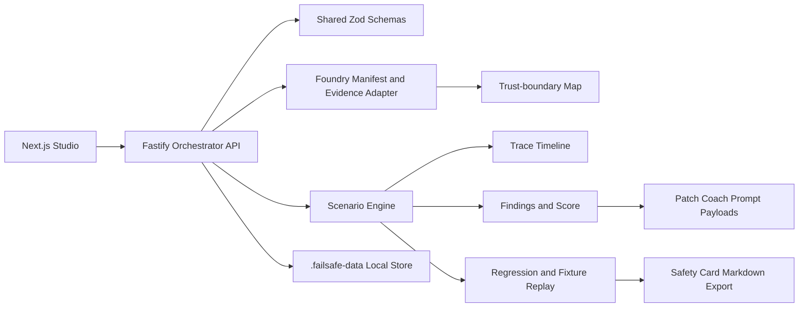

# FailSafe

Crash-test AI agents before production does.

FailSafe is a Microsoft Foundry-ready crash-test studio for agent builders. It imports reviewed Foundry-style manifests or reviewed recorded agent evidence, maps trust boundaries, runs local defensive crash tests, produces findings, prepares Patch Coach prompt payloads, saves regressions, replays reviewed fixtures, and exports Safety Cards without executing live tools or storing credentials.


## 2-minute pitch

Agent teams can build powerful Copilot-style and Azure AI Foundry agents quickly, but their pre-release safety checks are often scattered across prompts, logs, manual reviews, and informal red-team notes. FailSafe turns those reviews into a visible operations loop:

1. Import a reviewed Foundry manifest or recorded agent evidence.
2. Map instructions, tools, identity, RBAC, observability, approvals, and trust boundaries.
3. Run local crash tests for prompt injection, tool metadata poisoning, and approval bypass.
4. Inspect timeline evidence and root-cause findings.
5. Generate Patch Coach mitigation prompts for human review.
6. Save a regression, replay reviewed fixtures, compare baseline vs replay evidence, and export a Safety Card.

## Problem

Modern agents read retrieved content, plan tool calls, use MCP metadata, rely on identity scopes, and sometimes perform state-changing actions. Failures often happen at trust boundaries: untrusted content influences planning, tool metadata changes the task, approval state is assumed instead of verified, or RBAC/tool scopes are broader than the task requires.

Teams need a way to test those boundaries before shipping, explain what failed, preserve evidence for review, and rerun the same case after mitigation. FailSafe provides that local product loop.

## Microsoft relevance

FailSafe is aligned to the Microsoft Agents League Creative Apps track and the current Microsoft agent ecosystem:

- Azure AI Foundry-style manifest import for model, instructions, tools, identity, RBAC, observability, approval gates, and runtime blockers.
- Recorded agent evidence import for reviewed Foundry-style traces or agent outputs when credentials are not available.
- Trust-boundary maps that mirror the Foundry need for traceable, reviewable agent behavior.
- Local crash tests and fixture replay that fit the trust lifecycle described by Microsoft Foundry: identify risk, evaluate, apply controls, observe, and improve.
- Patch Coach payloads and repository prompts that support GitHub Copilot-assisted remediation while keeping all code changes under human review.

Official research reflected in this repo:

- Microsoft Agents League rules: https://github.com/microsoft/Agents-League-AISF-Regulations/blob/main/OFFICIAL%20RULES.md
- Creative Apps starter kit: https://github.com/microsoft/agentsleague/tree/main/starter-kits/1-creative-apps
- Fluent 2 design principles: https://fluent2.microsoft.design/design-principles
- Fluent 2 accessibility guidance: https://fluent2.microsoft.design/accessibility
- Microsoft Foundry trust stack blog: https://devblogs.microsoft.com/foundry/build-2026-open-trust-stack-ai-agents/
- Foundry tracing guidance: https://learn.microsoft.com/en-us/azure/ai-foundry/agents/concepts/tracing

## What works now

- Fluent-inspired Studio shell with command bar, navigation rail, Foundry operations panel, crash timeline, evidence inspector, patch/regression workspace, and Safety Card workspace.
- Fastify orchestrator API with typed Zod contracts.
- Foundry readiness validation for optional environment configuration.
- Reviewed Foundry-style manifest import.
- Reviewed recorded agent evidence import from JSON request bodies.
- Agent inventory and detail view.
- Trust-boundary map across user input, instructions, tools, identity/RBAC, approval gates, and policy decisions.
- Foundry manifest crash tests and fixture replay.
- Recorded-evidence crash tests.
- Sample Lab compatibility route for deterministic local fallback.
- Scenario packs for tool metadata poisoning, indirect prompt injection, and approval bypass.
- Findings, trace timeline, risk score, Patch Coach plans, regression artifacts, replay comparison, sandbox plan, fixture replay, and Safety Card reports.
- CLI coverage for readiness, manifest import, evidence import, trust maps, crash tests, fixture replay, Patch Coach, reports, runner dry-run, and reset.
- Release, API, CLI, and Studio smoke checks.

## Architecture



Repository layout:

```txt
apps/studio-web             Next.js Studio UI
apps/orchestrator-api       Fastify local orchestrator API
packages/schemas            Shared Zod schemas and TypeScript types
packages/attack-packs       Defensive scenario packs
packages/scenario-engine    Local crash-test, replay, Patch Coach, and sandbox-plan helpers
packages/scoring-engine     Crash-score heuristic
packages/trace-model        Trace and timeline helpers
examples/vulnerable-agent   Local Sample Lab fixture target
docs/                       Architecture, design, safety, demo, and submission materials
```

## Safety boundaries

FailSafe is defensive and local-first. The current product does not:

- execute arbitrary shell commands;
- read or write arbitrary user paths;
- store credentials;
- call live Foundry agents;
- call live LLM providers;
- execute MCP tools;
- test live external targets;
- send email;
- query or mutate databases;
- invoke GitHub Copilot from the app;
- claim fixture replay is production proof.

Compatibility endpoints such as `POST /runs/mock` and `POST /regressions/:id/replay-mock` remain because earlier scripts and docs used them. Product-facing copy names that path Sample Lab compatibility.

## Run locally

Prerequisites:

- Node.js 20 or newer
- pnpm 10 or newer

```bash
pnpm install
pnpm dev
```

Default local URLs:

- Studio: http://localhost:3000
- API health: http://localhost:4000/health

Run services separately:

```bash
pnpm dev:api
pnpm dev:web
```

## Environment

`.env.example` contains local defaults only. Foundry variables are optional and commented because this repo performs readiness validation only.

```bash
NEXT_PUBLIC_API_BASE_URL=http://localhost:4000
ORCHESTRATOR_API_PORT=4000

# Optional readiness validation only:
# AZURE_FOUNDRY_PROJECT_ENDPOINT=
# AZURE_FOUNDRY_AGENT_ID=
# AZURE_TENANT_ID=
# AZURE_FOUNDRY_MODEL_DEPLOYMENT=
```

Do not commit `.env`, credentials, or live service endpoints.

## Verification

```bash
pnpm install
pnpm check
pnpm build
pnpm release:check
pnpm smoke:api
pnpm smoke:cli
pnpm smoke:studio
```

`pnpm release:check` validates required docs/assets, local markdown links, screenshot references, secret patterns, active `.env` absence, and product-facing copy guardrails. `pnpm smoke:studio` starts the local API and Studio, drives the real browser flow with Playwright, checks keyboard focus and mobile overflow, and refreshes tracked screenshots.

## CLI examples

Start the API first:

```bash
pnpm dev:api
```

Then run:

```bash
pnpm failsafe foundry readiness
pnpm failsafe foundry import-sample
pnpm failsafe agents
pnpm failsafe agent trust-map <agent-id>
pnpm failsafe agent crash-test <agent-id> pack-tool-poisoning
pnpm failsafe agent fixture-replay <agent-id> pack-tool-poisoning
pnpm failsafe evidence import-sample
pnpm failsafe evidence list
pnpm failsafe evidence crash-test <evidence-id> pack-tool-poisoning
pnpm failsafe runs
pnpm failsafe regressions
pnpm failsafe replay <regression-id>
pnpm failsafe sandbox plan <regression-id>
pnpm failsafe sandbox fixture-replay <regression-id>
pnpm failsafe patch-coach <run-id>
pnpm failsafe report <run-id>
pnpm failsafe reports
pnpm failsafe runner preview
pnpm failsafe reset-demo-data
```

## API examples

Import the reviewed Foundry-style manifest:

```bash
curl -s http://localhost:4000/foundry/manifest/import \
  -H "content-type: application/json" \
  -d "{\"source\":\"sample\"}"
```

Import reviewed recorded agent evidence:

```bash
pnpm failsafe evidence import-sample
```

Run a local crash test for an imported agent:

```bash
curl -s http://localhost:4000/agents/<agent-id>/crash-test \
  -H "content-type: application/json" \
  -d "{\"scenarioPackId\":\"pack-tool-poisoning\"}"
```

Run a local recorded-evidence crash test:

```bash
curl -s http://localhost:4000/foundry/evidence/<evidence-id>/crash-test \
  -H "content-type: application/json" \
  -d "{\"scenarioPackId\":\"pack-tool-poisoning\"}"
```

Export a Safety Card:

```bash
curl -s http://localhost:4000/runs/<run-id>/report \
  -H "content-type: application/json" \
  -d "{}"
```

## Screenshots


App-owned brand assets:


## Demo flow

1. Open the Studio.
2. Import the reviewed Foundry manifest.
3. Load recorded evidence.
4. Show readiness and blocked capabilities.
5. Show the trust-boundary map.
6. Run a recorded-evidence crash test.
7. Inspect the timeline and finding detail.
8. Open Fix with Copilot and show the Patch Coach prompt payload.
9. Save a regression.
10. Run reviewed fixture replay and show comparison evidence.
11. Export the Safety Card.
12. Run one or two CLI commands to prove the same API-backed flow works outside the browser.

The full five-minute script is in `docs/demo-script.md`.

## Hackathon judging criteria mapping

The official rules list Accuracy and Relevance, Reasoning and Multi-step Thinking, Creativity and Originality, User Experience and Presentation, Reliability and Safety, and Community Vote. FailSafe maps to those criteria in `docs/submission-checklist.md`.

Required submitter-owned items are not invented in this repo:

- public GitHub repository URL;
- demo video URL, maximum five minutes;
- architecture diagram in the submission;
- project description;
- team/member information and Microsoft Learn usernames, if applicable.

## AI assistance disclosure

This repository contains GitHub Copilot-ready instructions, prompt files, custom agent instruction files, and Patch Coach payloads. Those artifacts show how a submitter can use Copilot for bounded defensive remediation.

This final completion pass was implemented with Codex in a local repository. FailSafe itself does not invoke GitHub Copilot, does not prove Copilot authored code, and does not fabricate Copilot usage. The final hackathon submitter should disclose the actual Copilot usage performed during their own development and video recording.

## Known intentional limits

- Live Foundry execution is not implemented.
- Foundry connected validation is readiness-only and makes no network call.
- Recorded evidence import accepts JSON request bodies only.
- Fixture replay uses reviewed app-owned fixtures only.
- Sample Lab compatibility routes are deterministic local fallback, not live agent execution.
- Patch Coach generates prompt payloads only.
- Safety Cards are local evidence summaries, not certifications.
- Authentication, deployment infrastructure, external persistence, live MCP tools, live model calls, and real sandbox isolation are future work.

## License

MIT. See `LICENSE`.
