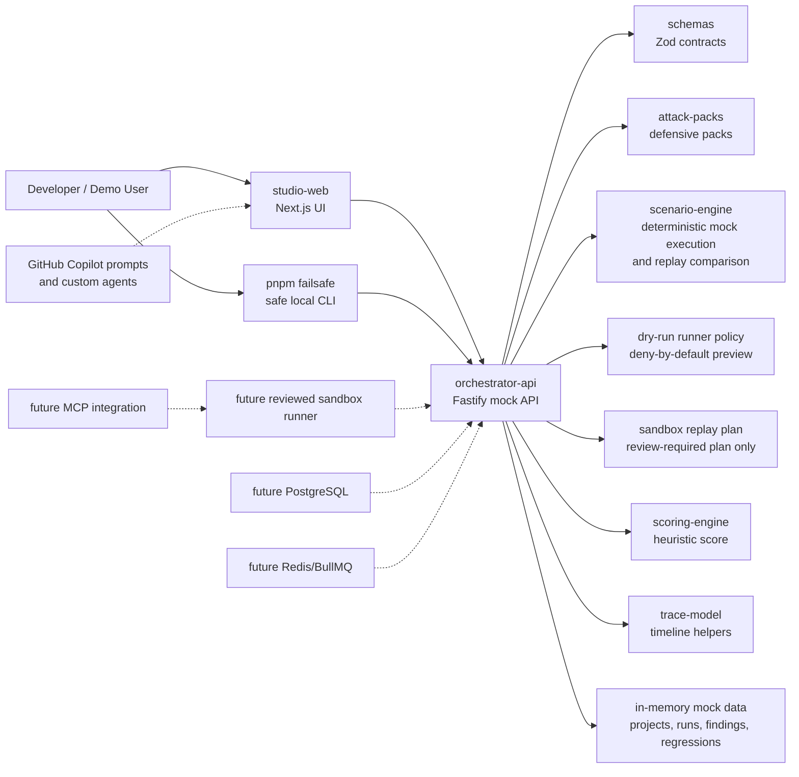

# Architecture

## System Architecture

FailSafe is a TypeScript-first monorepo. The Phase 3B slice uses a Next.js studio, Fastify orchestrator API, shared Zod schemas, typed scenario packs, a deterministic mock scenario engine, replay comparison helpers, a reviewed dry-run runner policy helper, a reviewed sandbox replay plan helper, scoring helpers, trace helpers, a safe local CLI, and synthetic demo data. The studio loads its project, scenario, run, finding, trace, score, regression, mock replay, baseline comparison, and sandbox plan state from the API. Runner readiness is shown as a dry-run contract only, and sandbox readiness is shown as a reviewed plan only; no real sandbox execution exists yet.

## Component Responsibilities

### `apps/studio-web`

Renders the FailSafe Studio dashboard. The current implementation uses a typed API client pointed at `NEXT_PUBLIC_API_BASE_URL` or `http://localhost:4000`. It handles loading, API unavailable, queued, running, completed, no-finding, Copilot preview, saved-regression, replay, baseline-vs-replay comparison, runner-readiness, and reviewed sandbox plan states.

### `apps/orchestrator-api`

Owns HTTP routes for health, projects, scenarios, runs, findings, regressions, replay comparison, dry-run runner policy preview, and reviewed sandbox planning. The current API returns mock data and stores created mock runs, replay runs, and regression artifacts in memory for the server process. It owns lifecycle materialization from `queued` to `running` to `needs_review`, while scenario-specific trace, finding, score generation, comparison helpers, runner policy preview helpers, and sandbox planning helpers live in `packages/scenario-engine`. Future work should add persistence, real run orchestration, reviewed fixture-only replay execution, sandbox dispatch, and trace collection from a runner.

### `packages/schemas`

Defines Zod schemas and TypeScript types for all core entities, including the `ReplayComparison`, dry-run runner, and reviewed sandbox replay plan contracts used by the API, CLI, dev check, and Studio. This package is the source of truth for data shape across apps and packages.

### `packages/attack-packs`

Defines typed defensive scenario packs. Packs must use synthetic examples and avoid real exploit instructions or live targets.

### `packages/scenario-engine`

Produces deterministic mock scenario executions. Given a project, agent target, scenario pack, run ID, seed, and start time, it builds a typed synthetic plan, emits trace events, creates scenario-specific findings, calculates scenario-specific score inputs, and returns a validated `ScenarioRun`. The package also compares a baseline run with a replay run and returns a validated `ReplayComparison`. Phase 3A adds a deny-by-default dry-run runner policy helper that validates intended actions and returns typed decisions with `executed: false` and `dryRunOnly: true`. Phase 3B adds a deterministic reviewed sandbox plan helper that derives a plan from a regression artifact, baseline run, scenario pack, project, and agent target. The same seed and scenario context produce stable event and finding ID suffixes. The engine, runner policy helper, and sandbox planner do not call real tools, files, shell commands, network, LLMs, MCP servers, Copilot, email, or databases.

### `scripts/failsafe.ts`

Provides the safe local CLI entrypoint exposed as `pnpm failsafe`. It calls the running mock API for regression listing, mock replay, dry-run runner policy preview, and reviewed sandbox planning, polls replay runs with a bounded timeout, and prints concise summaries. It does not read or write regression files, execute scenario tools, run shell commands, call live LLMs, call MCP servers, invoke Copilot, or contact external systems.

### `packages/scoring-engine`

Calculates the initial demo FailSafe score. The formula is a product heuristic and should remain clearly labeled as such.

### `packages/trace-model`

Provides trace-event parsing and timeline grouping helpers. Future work can add OpenTelemetry export mapping.

## Data Flow

1. Studio checks `GET /health`.
2. Studio loads projects, scenario packs, seeded runs, and regression artifacts from the orchestrator API.
3. User selects a scenario pack.
4. Studio starts a synthetic run through `POST /runs/mock`.
5. Orchestrator creates an in-memory run and materializes `queued`, `running`, and `needs_review` states when `GET /runs/:id` is polled.
6. Studio renders timeline events, scorecard factors, and findings from the API response.
7. User selects a timeline event to inspect metadata and raw evidence.
8. User selects a finding to inspect root cause, mitigations, and a Copilot prompt preview.
9. User saves a regression through `POST /regressions/mock`; the API creates an in-memory artifact with finding IDs, trace event IDs, expected safe behavior, deterministic seed, agent target ID, source run status, scenario version, expected finding categories, expected trace event types, and a mock replay endpoint.
10. User replays a saved artifact through `POST /regressions/:id/replay-mock`; the API verifies the artifact is mock replayable, calls the deterministic scenario engine with the saved seed, stores a new in-memory replay run with `baselineRunId`, and returns the replayed `ScenarioRun`.
11. Studio or CLI polls `GET /runs/:id` until the replay leaves `queued` or `running`.
12. Studio calls `GET /runs/:id/comparison` for the replay run. The API follows `baselineRunId`, compares the materialized baseline and replay runs, and returns a typed `ReplayComparison`.
13. Studio can call `POST /regressions/:id/sandbox-plan` for a saved regression. The API validates the in-memory regression, baseline run, project, scenario pack, and agent target, then returns a typed `SandboxReplayPlan` without executing anything.

## Dry-Run Runner Policy Preview Flow

1. A client submits `POST /runner/dry-run` with `projectId`, `scenarioPackId`, and typed intended actions.
2. The API validates the request with `RunnerDryRunInputSchema` and checks that the project and scenario pack exist in mock API data.
3. The API calls the dry-run runner policy helper in `packages/scenario-engine`.
4. The helper evaluates every action through a deny-by-default policy and returns typed decisions, trace-like evidence, and safety notes.
5. The result always includes `executed: false` and `dryRunOnly: true`.

Current Phase 3A policy:

- Synthetic low-risk `file_read` actions can be modeled as policy-preview allowed without reading any file.
- Non-synthetic file-read intent requires approval.
- `file_write`, `shell_command`, `network_request`, `email_send`, and `database_query` actions are blocked.
- `mcp_tool_call` and `model_call` actions are not implemented.
- Dry-run policy preview is not runtime isolation and must not be described as proof that untrusted code executed safely.

## Reviewed Sandbox Plan Flow

1. A client submits `POST /regressions/:id/sandbox-plan` for an in-memory regression artifact.
2. The API looks up the regression, baseline run, project, scenario pack, and agent target in memory.
3. If the regression is missing, the API returns `404 regression_not_found`.
4. If the baseline run is missing because the API process restarted or memory state was lost, the API returns `404 baseline_run_not_found` with an in-memory-only explanation.
5. The API calls `createReviewedSandboxReplayPlan` in `packages/scenario-engine`.
6. The helper returns a typed `SandboxReplayPlan` with `mode: plan_only`, `mockOnly: true`, `fixtureOnly: true`, `reviewStatus: human_review_required`, and `requiresHumanReview: true`.
7. The plan lists hardcoded synthetic fixture IDs for future review, blocked capabilities, safety boundaries, expected trace event types, expected finding categories, limitations, and not-implemented capabilities.

Current Phase 3B sandbox planning policy:

- The sandbox plan endpoint does not execute actions.
- Fixture replay execution is not implemented.
- Allowed fixture IDs are review metadata only.
- Shell commands, arbitrary file reads/writes, network requests, live target access, MCP calls, model calls, email sends, database queries, destructive operations, secret access, background workers, and persistence writes are blocked or not implemented.
- The plan is not runtime isolation proof and must not be described as real patched-agent validation.

## Trace Flow

Trace events use the shared `TraceEvent` schema:

- `id`
- `runId`
- `timestamp`
- `type`
- `actor`
- `trustBoundary`
- `inputSource`
- `summary`
- `raw`
- `parentEventId`
- `metadata`

Trace events should preserve provenance. Untrusted content, tool output, MCP metadata, repository files, and external network content must be labeled before they can influence model instructions or tool calls.

## Regression Artifact Flow

Phase 2 extends the shared `RegressionArtifact` schema with:

- `id`
- `runId`
- `projectId`
- `scenarioPackId`
- `agentTargetId`
- `seed`
- `sourceRunStatus`
- `mockReplayable`
- `scenarioVersion`
- `findingIds`
- `name`
- `description`
- `createdAt`
- `status`
- `replayCommand`
- `expectedSafeBehavior`
- `expectedFindingCategories`
- `expectedTraceEventTypes`
- `traceEventIds`

Regression artifacts are currently in-memory mock records only. They do not write files, update a database, or execute shell replay commands. Phase 2.5 replay can be triggered from the Studio or the safe local CLI, but both paths call the same mock API. `POST /regressions/:id/replay-mock` reruns the deterministic synthetic scenario in memory and never invokes real tools or external systems. `GET /runs/:id/comparison` compares synthetic mock runs only and must not be described as real mitigation proof.

## Mock CLI Flow

`pnpm failsafe regressions` calls `GET /regressions` and prints in-memory artifact IDs, names, scenario pack IDs, replayable status, and created time.

`pnpm failsafe replay <regression-id>` calls `POST /regressions/:id/replay-mock`, polls `GET /runs/:id`, and prints replay run ID, status, baseline run ID, scenario pack ID, score, finding count, trace event count, and a mock-only safety statement.

The CLI defaults to `http://localhost:4000` and supports `FAILSAFE_API_BASE_URL`. It requires a running API process and cannot replay artifacts from a previous process because persistence is intentionally not implemented.

`pnpm failsafe runner preview` calls `POST /runner/dry-run` with a synthetic action list and prints the deny-by-default policy decisions. It requires the API process but does not execute the listed actions.

`pnpm failsafe sandbox plan <regression-id>` calls `POST /regressions/:id/sandbox-plan` and prints plan ID, review status, mode, regression ID, baseline run ID, allowed fixture IDs, blocked capabilities, not-implemented capabilities, and the safety statement. It requires the same API process that created the in-memory regression and does not execute tools, shell commands, file actions, network calls, MCP servers, model calls, email, databases, or external systems.

## Runner Contract And Future Sandbox Design

Phase 3A implemented the runner contract, capability manifest, dry-run policy preview, API endpoint, CLI preview, dev-check validation, and Studio readiness panel. It did not implement a real sandbox runner.

Phase 3B implemented the reviewed sandbox replay plan contract, deterministic planner helper, plan endpoint, CLI plan command, dev-check validation, and Studio sandbox planning panel. It did not implement fixture replay execution or a real sandbox runner.

The future runner should:

- Execute only synthetic or user-approved scenarios.
- Default to dry-run mode.
- Block destructive file, shell, email, network, and database actions unless explicitly sandboxed.
- Run inside Docker or gVisor-style isolation.
- Capture stdout, stderr, tool calls, approvals, model messages, and policy decisions.
- Emit trace events through a narrow append-only API.
- Provide deterministic seeded mode for demos and regression tests.

## Future MCP Integration Design

MCP integration should:

- Discover MCP servers and tool metadata.
- Treat all MCP metadata as untrusted until reviewed.
- Pin metadata snapshots for reproducible tests.
- Label server transport and trust boundary.
- Prevent tool invocation until scopes and approval policy are evaluated.
- Provide a mock MCP server for demos.

## Future Copilot Workflow Design

Copilot should be used to:

- Explain crash-test failures from trace events.
- Propose bounded mitigation patches.
- Generate regression tests from failed scenarios.
- Create safe defensive scenario packs.
- Update architecture docs after implementation changes.

Copilot prompts must include safety constraints and avoid real offensive instructions.

## Security Boundaries

- Demo mode must not execute destructive actions.
- No real secrets should be committed or loaded into mock data.
- Untrusted input must be labeled by boundary.
- Approval-gated actions must produce `approval_requested` or `approval_skipped` trace events.
- External targets are out of scope until a reviewed sandbox and authorization model exist.
- Findings should recommend defensive mitigations only.
