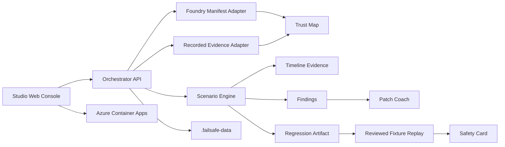

# Architecture

FailSafe is a launch-ready TypeScript monorepo for defensive agent safety testing. The primary product flow is Microsoft Foundry-style manifest import, reviewed recorded evidence import, trust-boundary mapping, local crash-test evaluation, Patch Coach handoff, regression capture, fixture replay, and Safety Card export. Fresh launch-mode state is empty until reviewed evidence is imported.

## Apps

`apps/studio-web` is the Next.js Studio. It uses a Fluent-inspired operations shell with a command bar, left navigation rail, primary workspace, and right evidence inspector. The first workflow is Foundry evidence: readiness, manifest import, recorded evidence import, agent inventory, trust map, and crash-test actions.

`apps/orchestrator-api` is the Fastify API. It owns health, Foundry readiness, gated connected probe/run metadata, connected validation, manifest import, evidence import, agents, trust maps, projects, scenarios, runs, findings, regressions, fixture replay, Patch Coach, reports, runner dry-run, and reset routes.

## Packages

`packages/schemas` contains the shared Zod contracts. The release path validates Foundry manifests, recorded evidence captures, trust maps, crash-test runs, regressions, fixture replay, sandbox plans, Patch Coach plans, and Safety Cards.

`packages/scenario-engine` creates deterministic local crash-test evidence, replay comparison, reviewed fixture replay, Patch Coach guidance, dry-run runner decisions, and reviewed sandbox plans. It does not call external systems.

`packages/attack-packs` contains defensive starter scenarios for tool metadata poisoning, indirect prompt injection, approval bypass, tool-output injection, and data-exfiltration attempts.

`packages/scoring-engine` contains the FailSafe score heuristic. It is a prioritization aid, not a formal standard.

## Evidence modes

FailSafe separates evidence modes explicitly:

- `recorded_agent_evidence`: reviewed JSON-body evidence imported locally and evaluated without credentials, paths, URLs, tools, or network.
- `foundry_manifest`: reviewed Foundry-style manifest analysis and modeled crash test.
- `reviewed_fixture_replay`: local replay against app-owned fixture IDs after a regression is saved.
- `sample_lab_fallback`: deterministic local fallback exposed through compatibility route names only when `FAILSAFE_ENABLE_SAMPLE_DATA=1`.

## Foundry workflow

1. `GET /foundry/readiness` checks optional environment variable readiness.
2. `POST /foundry/connected/validate` validates local configuration presence and does not call Foundry.
3. `GET /foundry/connected/probe` reports whether the live Foundry gate is disabled, missing configuration, or ready for a manual probe. It returns `attemptedLiveCall: false`.
4. `POST /foundry/connected/run` is disabled unless `FAILSAFE_ENABLE_LIVE_FOUNDRY=1` and required server-side metadata are present. The current launch route creates no external run and returns `runCreated: false`.
5. `POST /foundry/manifest/import` imports a reviewed manifest body. It accepts `{ "source": "sample" }`, a raw manifest JSON object, or `{ "manifest": ... }`.
6. `POST /foundry/evidence/import` imports reviewed JSON-body evidence.
7. `GET /agents` lists imported manifest-backed agents.
8. `GET /agents/:id/trust-map` maps user input, instructions, tools, identity/RBAC, approval gates, and policy boundaries.
9. `POST /agents/:id/crash-test` creates local trace evidence and findings from the reviewed manifest.
10. `POST /foundry/evidence/:id/crash-test` creates local trace evidence and findings from recorded evidence.
11. `POST /agents/:id/fixture-replay` creates local passed fixture evidence for a reviewed manifest.
12. `POST /runs/:id/report` exports the Safety Card.

## Compatibility routes

These route names remain for earlier scripts and compatibility:

- Preferred: `POST /runs/sample-lab`
- Preferred: `POST /regressions/sample-lab`
- Preferred: `POST /regressions/:id/replay-sample-lab`
- Compatibility aliases: `POST /runs/mock`, `POST /regressions/mock`, `POST /regressions/:id/replay-mock`

The Studio and docs call this path Sample Lab compatibility. It is deterministic local fallback only and is disabled in launch mode unless `FAILSAFE_ENABLE_SAMPLE_DATA=1` is set.

## Persistence

The API persists user-created local evidence in `.failsafe-data`, which is ignored by git. It stores runs, Foundry imports, recorded evidence captures, regressions, sandbox plans, fixture replay results, and reports. Reset clears only this app-owned store. Launch mode does not seed sample projects or runs.

## Azure deployment

The deployment scaffold targets Azure Container Apps:

- `web`: Next.js Studio container exposed publicly.
- `api`: Fastify Orchestrator API container exposed publicly for browser/API smoke tests.
- `infra/main.bicep`: Container Apps managed environment and Log Analytics workspace.
- `azure.yaml`: Azure Developer CLI project metadata.

The hosted web app calls same-origin `/api/failsafe/*`, and the Next.js route proxy forwards those requests to `ORCHESTRATOR_API_BASE_URL` at runtime. Launch deployments should keep `FAILSAFE_ENABLE_SAMPLE_DATA=0`. The scaffold is demo-grade: no auth is configured, app-owned `.failsafe-data` persistence is ephemeral in Container Apps, and live Foundry execution is blocked by default.

## Safety model

The current architecture blocks arbitrary shell execution, arbitrary path access, credential storage, live Foundry calls, live MCP execution, live model calls, email/database side effects, and external target testing. All high-risk activity is represented as reviewed local evidence, typed policy decisions, or blocked capabilities.
