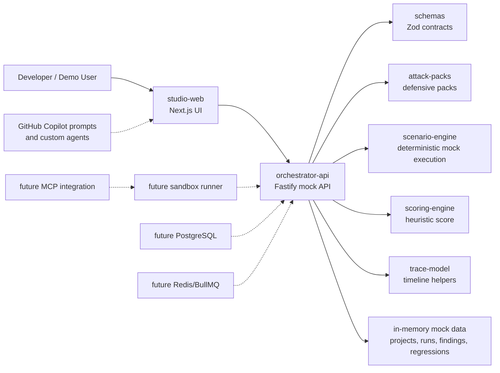

# Architecture

## System Architecture

FailSafe is a TypeScript-first monorepo. The Phase 2 slice uses a Next.js studio, Fastify orchestrator API, shared Zod schemas, typed scenario packs, a deterministic mock scenario engine, scoring helpers, trace helpers, and synthetic demo data. The studio loads its project, scenario, run, finding, trace, score, regression, and mock replay state from the API.

## Component Responsibilities

### `apps/studio-web`

Renders the FailSafe Studio dashboard. The current implementation uses a typed API client pointed at `NEXT_PUBLIC_API_BASE_URL` or `http://localhost:4000`. It handles loading, API unavailable, queued, running, completed, no-finding, Copilot preview, and saved-regression states.

### `apps/orchestrator-api`

Owns HTTP routes for health, projects, scenarios, runs, findings, and regressions. The current API returns mock data and stores created mock runs, replay runs, and regression artifacts in memory for the server process. It owns lifecycle materialization from `queued` to `running` to `needs_review`, while scenario-specific trace, finding, and score generation lives in `packages/scenario-engine`. Future work should add persistence, real run orchestration, sandbox dispatch, trace collection from a runner, and reviewed sandbox replay execution.

### `packages/schemas`

Defines Zod schemas and TypeScript types for all core entities. This package is the source of truth for data shape across apps and packages.

### `packages/attack-packs`

Defines typed defensive scenario packs. Packs must use synthetic examples and avoid real exploit instructions or live targets.

### `packages/scenario-engine`

Produces deterministic mock scenario executions. Given a project, agent target, scenario pack, run ID, seed, and start time, it builds a typed synthetic plan, emits trace events, creates scenario-specific findings, calculates scenario-specific score inputs, and returns a validated `ScenarioRun`. The same seed and scenario context produce stable event and finding ID suffixes. The engine does not call real tools, files, shell commands, network, LLMs, MCP servers, Copilot, email, or databases.

### `packages/scoring-engine`

Calculates the initial demo FailSafe score. The formula is a product heuristic and should remain clearly labeled as such.

### `packages/trace-model`

Provides trace-event parsing and timeline grouping helpers. Future work can add OpenTelemetry export mapping.

## Data Flow

1. Studio checks `GET /health`.
2. Studio loads projects, scenario packs, seeded runs, and regression artifacts from the orchestrator API.
3. User selects a scenario pack.
4. Studio starts a synthetic run through `POST /runs/mock`.
5. Orchestrator creates an in-memory run and materializes `queued`, `running`, and `needs_review` states when `GET /runs/:id` is polled.
6. Studio renders timeline events, scorecard factors, and findings from the API response.
7. User selects a timeline event to inspect metadata and raw evidence.
8. User selects a finding to inspect root cause, mitigations, and a Copilot prompt preview.
9. User saves a regression through `POST /regressions/mock`; the API creates an in-memory artifact with finding IDs, trace event IDs, expected safe behavior, deterministic seed, agent target ID, source run status, scenario version, expected finding categories, expected trace event types, and a mock replay endpoint.
10. User replays a saved artifact through `POST /regressions/:id/replay-mock`; the API verifies the artifact is mock replayable, calls the deterministic scenario engine with the saved seed, stores a new in-memory replay run with `baselineRunId`, and returns the replayed `ScenarioRun`.

## Trace Flow

Trace events use the shared `TraceEvent` schema:

- `id`
- `runId`
- `timestamp`
- `type`
- `actor`
- `trustBoundary`
- `inputSource`
- `summary`
- `raw`
- `parentEventId`
- `metadata`

Trace events should preserve provenance. Untrusted content, tool output, MCP metadata, repository files, and external network content must be labeled before they can influence model instructions or tool calls.

## Regression Artifact Flow

Phase 2 extends the shared `RegressionArtifact` schema with:

- `id`
- `runId`
- `projectId`
- `scenarioPackId`
- `agentTargetId`
- `seed`
- `sourceRunStatus`
- `mockReplayable`
- `scenarioVersion`
- `findingIds`
- `name`
- `description`
- `createdAt`
- `status`
- `replayCommand`
- `expectedSafeBehavior`
- `expectedFindingCategories`
- `expectedTraceEventTypes`
- `traceEventIds`

Regression artifacts are currently in-memory mock records only. They do not write files, update a database, or execute shell replay commands. Phase 2 replay is API-only: `POST /regressions/:id/replay-mock` reruns the deterministic synthetic scenario in memory and never invokes real tools or external systems.

## Future Sandbox Runner Design

The future runner should:

- Execute only synthetic or user-approved scenarios.
- Default to dry-run mode.
- Block destructive file, shell, email, network, and database actions unless explicitly sandboxed.
- Run inside Docker or gVisor-style isolation.
- Capture stdout, stderr, tool calls, approvals, model messages, and policy decisions.
- Emit trace events through a narrow append-only API.
- Provide deterministic seeded mode for demos and regression tests.

## Future MCP Integration Design

MCP integration should:

- Discover MCP servers and tool metadata.
- Treat all MCP metadata as untrusted until reviewed.
- Pin metadata snapshots for reproducible tests.
- Label server transport and trust boundary.
- Prevent tool invocation until scopes and approval policy are evaluated.
- Provide a mock MCP server for demos.

## Future Copilot Workflow Design

Copilot should be used to:

- Explain crash-test failures from trace events.
- Propose bounded mitigation patches.
- Generate regression tests from failed scenarios.
- Create safe defensive scenario packs.
- Update architecture docs after implementation changes.

Copilot prompts must include safety constraints and avoid real offensive instructions.

## Security Boundaries

- Demo mode must not execute destructive actions.
- No real secrets should be committed or loaded into mock data.
- Untrusted input must be labeled by boundary.
- Approval-gated actions must produce `approval_requested` or `approval_skipped` trace events.
- External targets are out of scope until a reviewed sandbox and authorization model exist.
- Findings should recommend defensive mitigations only.
