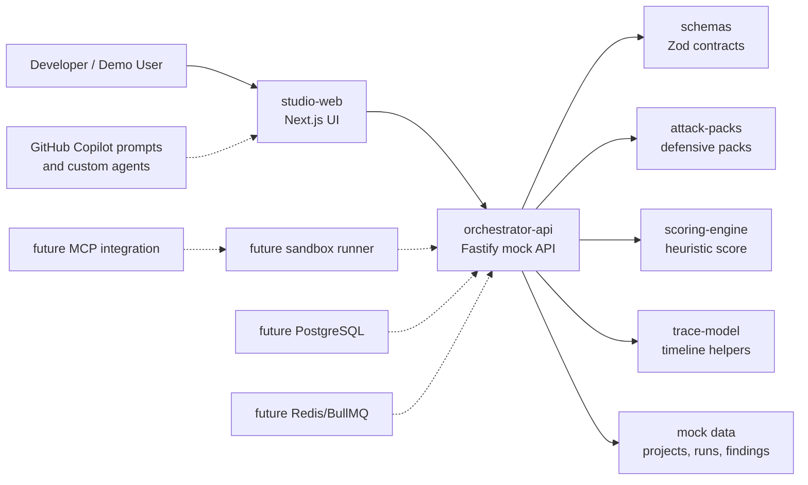

# Architecture

## System Architecture

FailSafe is a TypeScript-first monorepo. The foundation uses a Next.js studio, Fastify orchestrator API, shared Zod schemas, typed scenario packs, scoring helpers, trace helpers, and synthetic demo data.

## Component Responsibilities

### `apps/studio-web`

Renders the FailSafe Studio dashboard. The current implementation uses local mock data and shared schemas. Future work should move data fetching to the orchestrator API while keeping the UI contract stable.

### `apps/orchestrator-api`

Owns HTTP routes for health, projects, scenarios, runs, and findings. The current API returns mock data. Future work should add persistence, run orchestration, sandbox dispatch, trace collection, and regression artifacts.

### `packages/schemas`

Defines Zod schemas and TypeScript types for all core entities. This package is the source of truth for data shape across apps and packages.

### `packages/attack-packs`

Defines typed defensive scenario packs. Packs must use synthetic examples and avoid real exploit instructions or live targets.

### `packages/scoring-engine`

Calculates the initial demo FailSafe score. The formula is a product heuristic and should remain clearly labeled as such.

### `packages/trace-model`

Provides trace-event parsing and timeline grouping helpers. Future work can add OpenTelemetry export mapping.

## Data Flow

1. Studio loads projects and scenario packs.
2. User selects a scenario pack.
3. Studio starts a run through the orchestrator.
4. Orchestrator creates a run record.
5. Runner emits trace events.
6. Scoring engine calculates score factors.
7. Crash analyst creates findings from trace evidence.
8. Studio renders timeline, scorecard, and findings.
9. User invokes Copilot prompts for mitigation and regression generation.

## Trace Flow

Trace events use the shared `TraceEvent` schema:

- `id`
- `runId`
- `timestamp`
- `type`
- `actor`
- `trustBoundary`
- `inputSource`
- `summary`
- `raw`
- `parentEventId`
- `metadata`

Trace events should preserve provenance. Untrusted content, tool output, MCP metadata, repository files, and external network content must be labeled before they can influence model instructions or tool calls.

## Future Sandbox Runner Design

The future runner should:

- Execute only synthetic or user-approved scenarios.
- Default to dry-run mode.
- Block destructive file, shell, email, network, and database actions unless explicitly sandboxed.
- Run inside Docker or gVisor-style isolation.
- Capture stdout, stderr, tool calls, approvals, model messages, and policy decisions.
- Emit trace events through a narrow append-only API.
- Provide deterministic seeded mode for demos and regression tests.

## Future MCP Integration Design

MCP integration should:

- Discover MCP servers and tool metadata.
- Treat all MCP metadata as untrusted until reviewed.
- Pin metadata snapshots for reproducible tests.
- Label server transport and trust boundary.
- Prevent tool invocation until scopes and approval policy are evaluated.
- Provide a mock MCP server for demos.

## Future Copilot Workflow Design

Copilot should be used to:

- Explain crash-test failures from trace events.
- Propose bounded mitigation patches.
- Generate regression tests from failed scenarios.
- Create safe defensive scenario packs.
- Update architecture docs after implementation changes.

Copilot prompts must include safety constraints and avoid real offensive instructions.

## Security Boundaries

- Demo mode must not execute destructive actions.
- No real secrets should be committed or loaded into mock data.
- Untrusted input must be labeled by boundary.
- Approval-gated actions must produce `approval_requested` or `approval_skipped` trace events.
- External targets are out of scope until a reviewed sandbox and authorization model exist.
- Findings should recommend defensive mitigations only.
