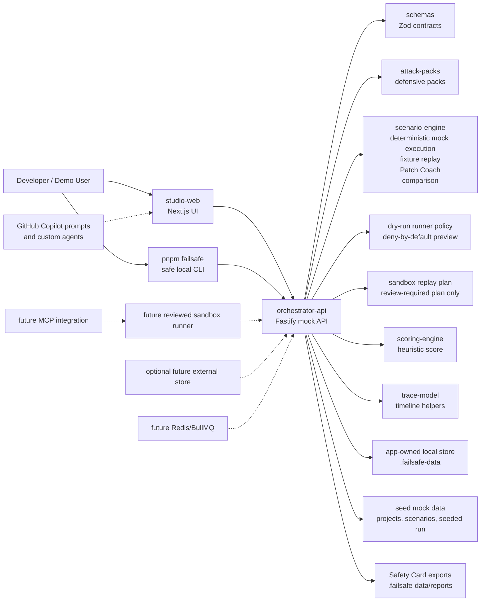

# Architecture

## System Architecture

FailSafe is a TypeScript-first monorepo. The current local product uses a Next.js studio, Fastify orchestrator API, shared Zod schemas, typed scenario packs, a deterministic mock scenario engine, reviewed fixture-only replay, replay comparison helpers, Patch Coach helpers, local Safety Card export, a reviewed dry-run runner policy helper, a reviewed sandbox replay plan helper, scoring helpers, trace helpers, a safe local CLI, app-owned local persistence, and synthetic demo data. The studio loads project, scenario, run, finding, trace, score, regression, mock replay, fixture replay, baseline comparison, Patch Coach, report, and sandbox plan state from the API. Runner readiness is shown as a dry-run contract, fixture replay is synthetic and allowlisted, and real sandbox execution remains future work.

## Component Responsibilities

### `apps/studio-web`

Renders the FailSafe Studio dashboard. The current implementation uses a typed API client pointed at `NEXT_PUBLIC_API_BASE_URL` or `http://localhost:4000`. It handles loading, API unavailable, queued, running, completed, no-finding, Copilot preview, saved-regression, replay, baseline-vs-replay comparison, runner-readiness, and reviewed sandbox plan states.

### `apps/orchestrator-api`

Owns HTTP routes for health, projects, scenarios, runs, findings, regressions, mock replay, fixture replay, replay comparison, Patch Coach, Safety Card reports, demo reset, dry-run runner policy preview, and reviewed sandbox planning. The API returns seeded mock data and persists non-seed runs, replay runs, regression artifacts, sandbox plans, fixture replay results, and reports in the app-owned `.failsafe-data` store. It owns lifecycle materialization from `queued` to `running` to `needs_review`, while scenario-specific trace, finding, score generation, fixture replay, Patch Coach, comparison helpers, runner policy preview helpers, and sandbox planning helpers live in `packages/scenario-engine`. Future work should add real sandbox dispatch and trace collection from an isolated runner.

### `packages/schemas`

Defines Zod schemas and TypeScript types for all core entities, including `ReplayComparison`, fixture replay results, Patch Coach plans, Safety Reports, dry-run runner, and reviewed sandbox replay plan contracts used by the API, CLI, dev check, and Studio. This package is the source of truth for data shape across apps and packages.

### `packages/attack-packs`

Defines typed defensive scenario packs. Packs must use synthetic examples and avoid real exploit instructions or live targets.

### `packages/scenario-engine`

Produces deterministic mock scenario executions. Given a project, agent target, scenario pack, run ID, seed, and start time, it builds a typed synthetic plan, emits trace events, creates scenario-specific findings, calculates scenario-specific score inputs, and returns a validated `ScenarioRun`. The package also compares a baseline run with a replay run and returns a validated `ReplayComparison`. It includes a reviewed fixture replay helper that creates a `passed` synthetic replay run only from app-owned fixture IDs, and a Patch Coach helper that generates prompt payloads without invoking Copilot. The dry-run runner policy helper validates intended actions and returns typed decisions with `executed: false` and `dryRunOnly: true`. The reviewed sandbox plan helper derives a plan from a regression artifact, baseline run, scenario pack, project, and agent target. The engine, runner policy helper, fixture replay helper, Patch Coach helper, and sandbox planner do not call real tools, arbitrary files, shell commands, network, LLMs, MCP servers, Copilot, email, or databases.

### `scripts/failsafe.ts`

Provides the safe local CLI entrypoint exposed as `pnpm failsafe`. It calls the running API for run listing, regression listing, mock replay, reviewed fixture replay, Patch Coach, report export, report listing, demo reset, dry-run runner policy preview, and reviewed sandbox planning. It polls mock replay runs with a bounded timeout and prints concise summaries. It does not read client paths, execute scenario tools, run shell commands, call live LLMs, call MCP servers, invoke Copilot, or contact external systems.

### `packages/scoring-engine`

Calculates the initial demo FailSafe score. The formula is a product heuristic and should remain clearly labeled as such.

### `packages/trace-model`

Provides trace-event parsing and timeline grouping helpers. Future work can add OpenTelemetry export mapping.

## Data Flow

1. Studio checks `GET /health`.
2. Studio loads projects, scenario packs, seeded runs, and regression artifacts from the orchestrator API.
3. User selects a scenario pack.
4. Studio starts a synthetic run through `POST /runs/mock`.
5. Orchestrator creates a persisted local run and materializes `queued`, `running`, and `needs_review` states when `GET /runs/:id` is polled.
6. Studio renders timeline events, scorecard factors, and findings from the API response.
7. User selects a timeline event to inspect metadata and raw evidence.
8. User selects a finding to inspect root cause, mitigations, and a Copilot prompt preview.
9. User saves a regression through `POST /regressions/mock`; the API creates a persisted local artifact with finding IDs, trace event IDs, expected safe behavior, deterministic seed, agent target ID, source run status, scenario version, expected finding categories, expected trace event types, and a mock replay endpoint.
10. User replays a saved artifact through `POST /regressions/:id/replay-mock`; the API verifies the artifact is mock replayable, calls the deterministic scenario engine with the saved seed, stores a new local replay run with `baselineRunId`, and returns the replayed `ScenarioRun`.
11. Studio or CLI polls `GET /runs/:id` until the replay leaves `queued` or `running`.
12. Studio calls `GET /runs/:id/comparison` for the replay run. The API follows `baselineRunId`, compares the materialized baseline and replay runs, and returns a typed `ReplayComparison`.
13. Studio can call `POST /regressions/:id/sandbox-plan` for a saved regression. The API validates the local regression, baseline run, project, scenario pack, and agent target, then returns a typed `SandboxReplayPlan` without arbitrary execution.
14. Studio can call `POST /regressions/:id/fixture-replay` for a saved regression. The API validates the plan allowlist, creates a fixture-only synthetic replay run, persists a fixture replay result, and returns comparison evidence.
15. Studio can call `POST /runs/:id/patch-coach` and `POST /runs/:id/report` to generate a Patch Coach plan and app-owned Markdown Safety Card.

## Dry-Run Runner Policy Preview Flow

1. A client submits `POST /runner/dry-run` with `projectId`, `scenarioPackId`, and typed intended actions.
2. The API validates the request with `RunnerDryRunInputSchema` and checks that the project and scenario pack exist in mock API data.
3. The API calls the dry-run runner policy helper in `packages/scenario-engine`.
4. The helper evaluates every action through a deny-by-default policy and returns typed decisions, trace-like evidence, and safety notes.
5. The result always includes `executed: false` and `dryRunOnly: true`.

Current Phase 3A policy:

- Synthetic low-risk `file_read` actions can be modeled as policy-preview allowed without reading any file.
- Non-synthetic file-read intent requires approval.
- `file_write`, `shell_command`, `network_request`, `email_send`, and `database_query` actions are blocked.
- `mcp_tool_call` and `model_call` actions are not implemented.
- Dry-run policy preview is not runtime isolation and must not be described as proof that untrusted code executed safely.

## Reviewed Sandbox Plan Flow

1. A client submits `POST /regressions/:id/sandbox-plan` for a local regression artifact.
2. The API looks up the regression, baseline run, project, scenario pack, and agent target in memory.
3. If the regression is missing, the API returns `404 regression_not_found`.
4. If the baseline run is missing because demo data was reset, the API returns `404 baseline_run_not_found`.
5. The API calls `createReviewedSandboxReplayPlan` in `packages/scenario-engine`.
6. The helper returns a typed `SandboxReplayPlan` with `mode: plan_only`, `mockOnly: true`, `fixtureOnly: true`, `reviewStatus: human_review_required`, and `requiresHumanReview: true`.
7. The plan lists hardcoded synthetic fixture IDs for future review, blocked capabilities, safety boundaries, expected trace event types, expected finding categories, limitations, and not-implemented capabilities.

Current Phase 3B sandbox planning policy:

- The sandbox plan endpoint does not execute actions.
- Fixture replay execution is implemented only for reviewed app-owned synthetic fixtures.
- Allowed fixture IDs are review metadata and fixture replay allowlist inputs.
- Shell commands, arbitrary file reads/writes, network requests, live target access, MCP calls, model calls, email sends, database queries, destructive operations, secret access, and background workers are blocked or not implemented.
- The plan is not runtime isolation proof and must not be described as real patched-agent validation.

## Fixture Replay Flow

1. A client submits `POST /regressions/:id/fixture-replay`.
2. The API loads or creates the reviewed sandbox plan for that regression.
3. The scenario engine verifies that plan fixture IDs match FailSafe-owned synthetic fixture identifiers.
4. The engine creates a typed `ScenarioRun` with `status: passed`, no open findings, synthetic trace events, and `baselineRunId`.
5. The API persists the replay run and `FixtureReplayResult` in `.failsafe-data`.
6. The result includes a `ReplayComparison` showing score, finding, and trace deltas.

Fixture replay does not accept paths, URLs, commands, arbitrary tool names, MCP targets, model targets, email targets, database targets, secrets, or live targets. It is not arbitrary sandbox execution or runtime isolation proof.

## Trace Flow

Trace events use the shared `TraceEvent` schema:

- `id`
- `runId`
- `timestamp`
- `type`
- `actor`
- `trustBoundary`
- `inputSource`
- `summary`
- `raw`
- `parentEventId`
- `metadata`

Trace events should preserve provenance. Untrusted content, tool output, MCP metadata, repository files, and external network content must be labeled before they can influence model instructions or tool calls.

## Regression Artifact Flow

Phase 2 extends the shared `RegressionArtifact` schema with:

- `id`
- `runId`
- `projectId`
- `scenarioPackId`
- `agentTargetId`
- `seed`
- `sourceRunStatus`
- `mockReplayable`
- `scenarioVersion`
- `findingIds`
- `name`
- `description`
- `createdAt`
- `status`
- `replayCommand`
- `expectedSafeBehavior`
- `expectedFindingCategories`
- `expectedTraceEventTypes`
- `traceEventIds`

Regression artifacts are local persisted mock records in `.failsafe-data`. They do not execute shell replay commands or touch external databases. Replay can be triggered from the Studio or the safe local CLI, and both paths call the same API. `POST /regressions/:id/replay-mock` reruns the deterministic synthetic scenario and never invokes real tools or external systems. `POST /regressions/:id/fixture-replay` creates reviewed fixture-only synthetic replay evidence. `GET /runs/:id/comparison` compares synthetic runs only and must not be described as real mitigation proof.

## Mock CLI Flow

`pnpm failsafe runs` calls `GET /runs` and prints current local run summaries.

`pnpm failsafe regressions` calls `GET /regressions` and prints local artifact IDs, names, scenario pack IDs, replayable status, and created time.

`pnpm failsafe replay <regression-id>` calls `POST /regressions/:id/replay-mock`, polls `GET /runs/:id`, and prints replay run ID, status, baseline run ID, scenario pack ID, score, finding count, trace event count, and a mock-only safety statement.

`pnpm failsafe sandbox fixture-replay <regression-id>` calls `POST /regressions/:id/fixture-replay` and prints result, replay run, comparison, allowed fixture IDs, and safety statement.

`pnpm failsafe patch-coach <run-id> [finding-id]` calls `POST /runs/:id/patch-coach` and prints mitigation steps and prompt file handoffs.

`pnpm failsafe report <run-id>` calls `POST /runs/:id/report` and prints the app-owned Safety Card path. `pnpm failsafe reports` lists prior report exports.

`pnpm failsafe reset-demo-data` calls `POST /demo/reset` and clears only `.failsafe-data` state.

The CLI defaults to `http://localhost:4000` and supports `FAILSAFE_API_BASE_URL`. It requires a running API process and uses the local app-owned store for persisted artifacts.

`pnpm failsafe runner preview` calls `POST /runner/dry-run` with a synthetic action list and prints the deny-by-default policy decisions. It requires the API process but does not execute the listed actions.

`pnpm failsafe sandbox plan <regression-id>` calls `POST /regressions/:id/sandbox-plan` and prints plan ID, review status, mode, regression ID, baseline run ID, allowed fixture IDs, blocked capabilities, not-implemented capabilities, and the safety statement. It uses the local app-owned regression store and does not execute tools, shell commands, file actions, network calls, MCP servers, model calls, email, databases, or external systems.

## Runner Contract And Future Sandbox Design

Phase 3A implemented the runner contract, capability manifest, dry-run policy preview, API endpoint, CLI preview, dev-check validation, and Studio readiness panel. It did not implement a real sandbox runner.

Phase 3B implemented the reviewed sandbox replay plan contract, deterministic planner helper, plan endpoint, CLI plan command, dev-check validation, and Studio sandbox planning panel. It did not implement fixture replay execution or a real sandbox runner.

The future runner should:

- Execute only synthetic or user-approved scenarios.
- Default to dry-run mode.
- Block destructive file, shell, email, network, and database actions unless explicitly sandboxed.
- Run inside Docker or gVisor-style isolation.
- Capture stdout, stderr, tool calls, approvals, model messages, and policy decisions.
- Emit trace events through a narrow append-only API.
- Provide deterministic seeded mode for demos and regression tests.

## Future MCP Integration Design

MCP integration should:

- Discover MCP servers and tool metadata.
- Treat all MCP metadata as untrusted until reviewed.
- Pin metadata snapshots for reproducible tests.
- Label server transport and trust boundary.
- Prevent tool invocation until scopes and approval policy are evaluated.
- Provide a mock MCP server for demos.

## Future Copilot Workflow Design

Copilot should be used to:

- Explain crash-test failures from trace events.
- Propose bounded mitigation patches.
- Generate regression tests from failed scenarios.
- Create safe defensive scenario packs.
- Update architecture docs after implementation changes.

Copilot prompts must include safety constraints and avoid real offensive instructions.

## Security Boundaries

- Demo mode must not execute destructive actions.
- No real secrets should be committed or loaded into mock data.
- Untrusted input must be labeled by boundary.
- Approval-gated actions must produce `approval_requested` or `approval_skipped` trace events.
- External targets are out of scope until a reviewed sandbox and authorization model exist.
- Findings should recommend defensive mitigations only.
